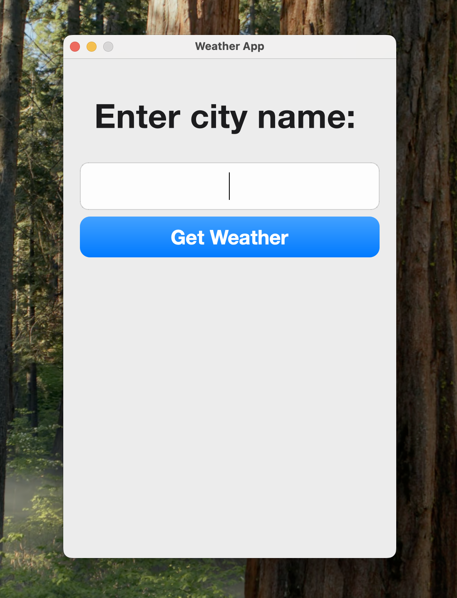
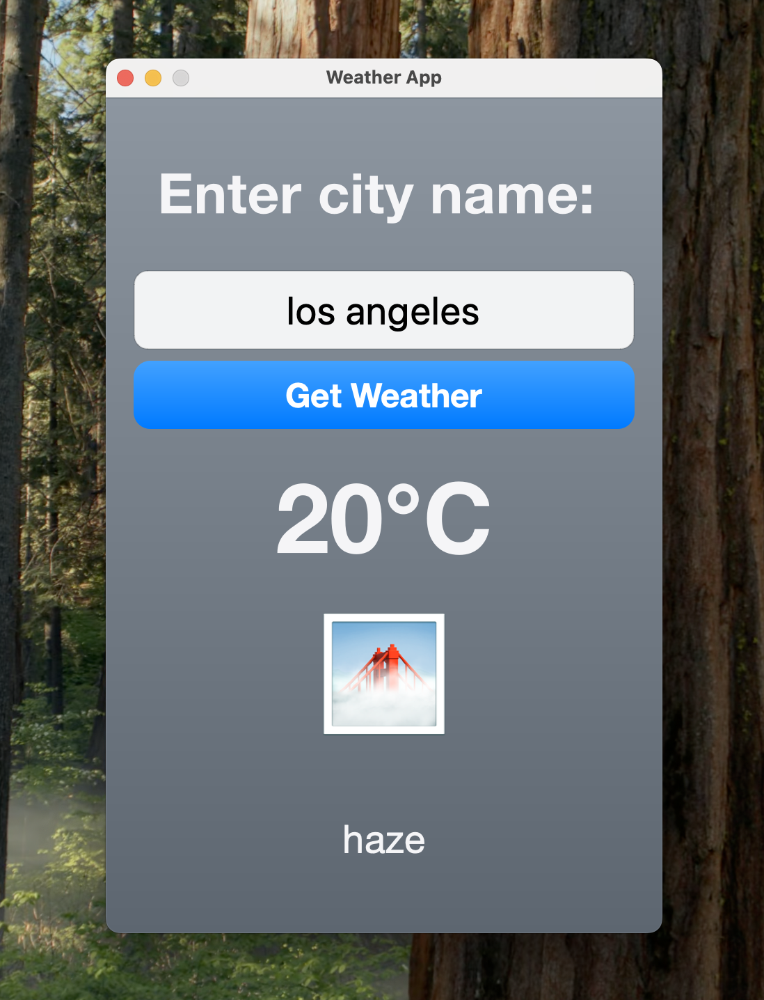
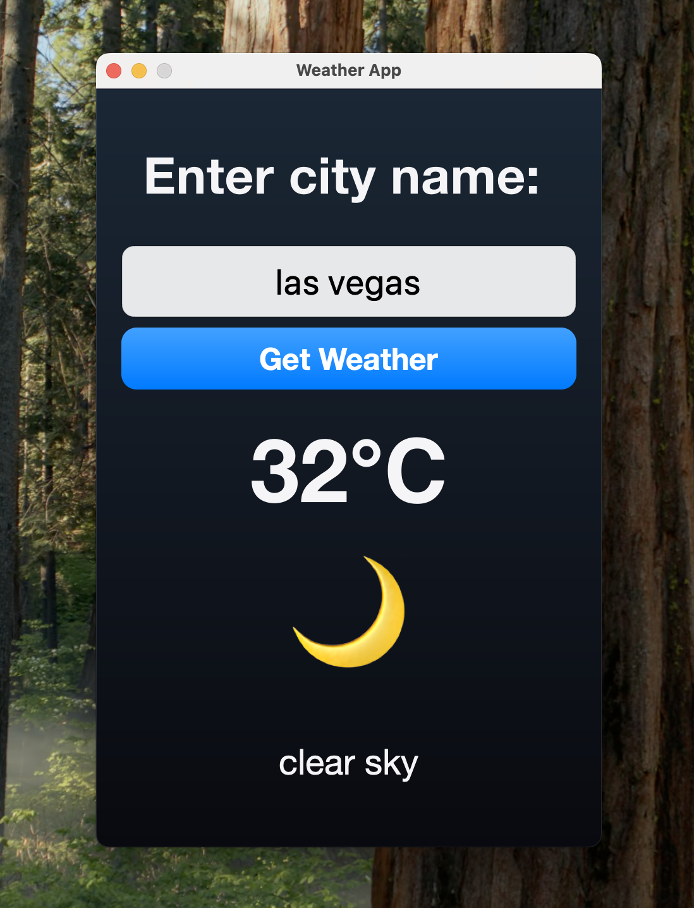

# PythonWeatherApp
A simple but stylish weather application built with Python 3.12, PyQt5, and the OpenWeatherAPI.
It features:
- Dynamic dark/light theme switching based on time of day
- Weather-specific backgrounds and emojis
- Modular code for clarity and easy maintenance
- Custom styling via an external QSS file

<p style="display: flex">
    
    
    
</p>

---
## 📂 Project Structure
```
main.py               # Entry point for the application
dataFetcher.py        # Handles data requests to the OpenWeatherAPI
weatherApp.py         # Main widget/UI logic
weatherFunctions.py   # Provides logical methods (e.g., weather emoji mapping, theme switching)
styles.qss            # External stylesheet for UI elements
```
---
## 📦 Dependencies
You need the following Python packages installed:
```
pip install requests PyQt5
```
---
## 🔑 API Key
This project requires an OpenWeatherAPI key.

You can obtain one by signing up at: https://openweathermap.org/api

Insert your API key inside weatherApp.py:
```
def get_data(self):
    api_key = "YOUR_API_KEY"
    ...
```
---
## ▶️ How to Run
Make sure you are using ``Python 3.12`` (or compatible).
```
Windows / Linux:
    python main.py
```
```
macOS:
    python3 main.py
```
---
## 💡 Credits
This project is based on the work of BroCode on YouTube, with significant updates and customization:
- Improved styling
- Dynamic dark/light themes
- Modularized code for better readability and maintainability